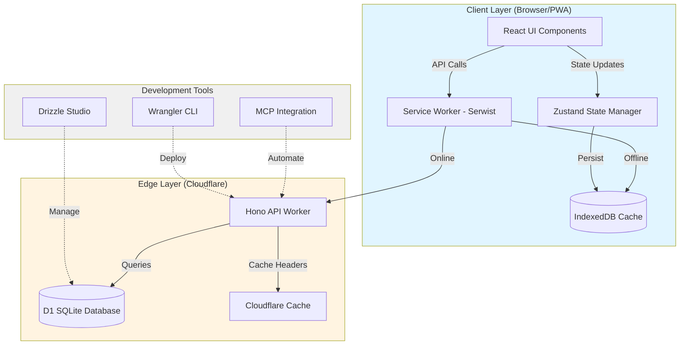
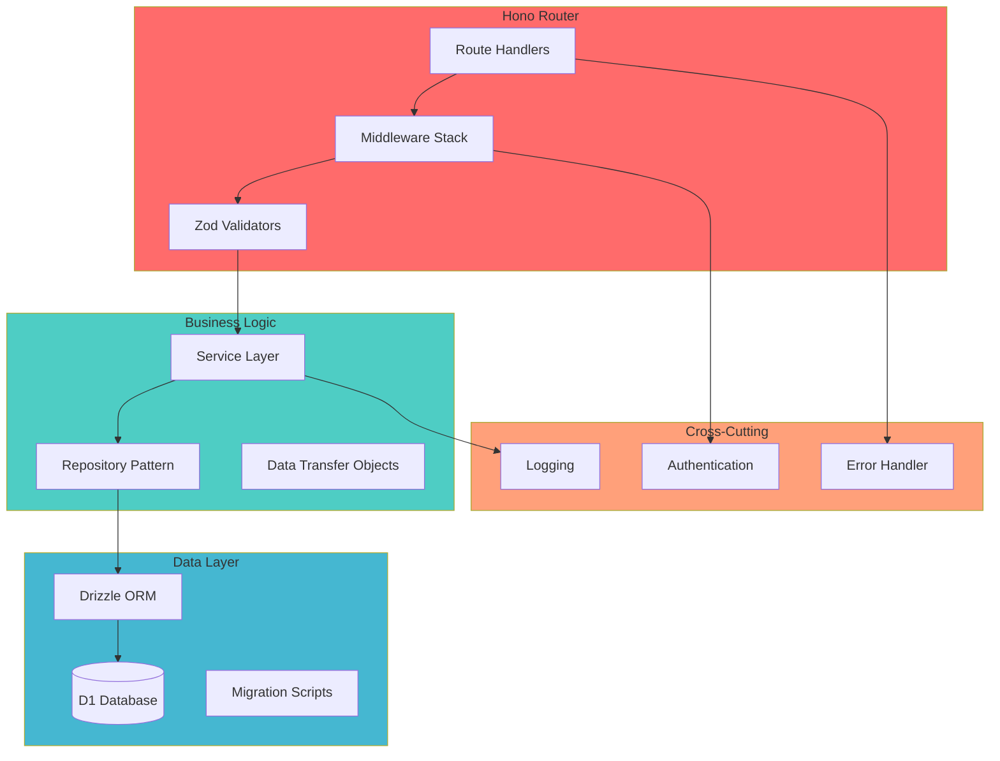
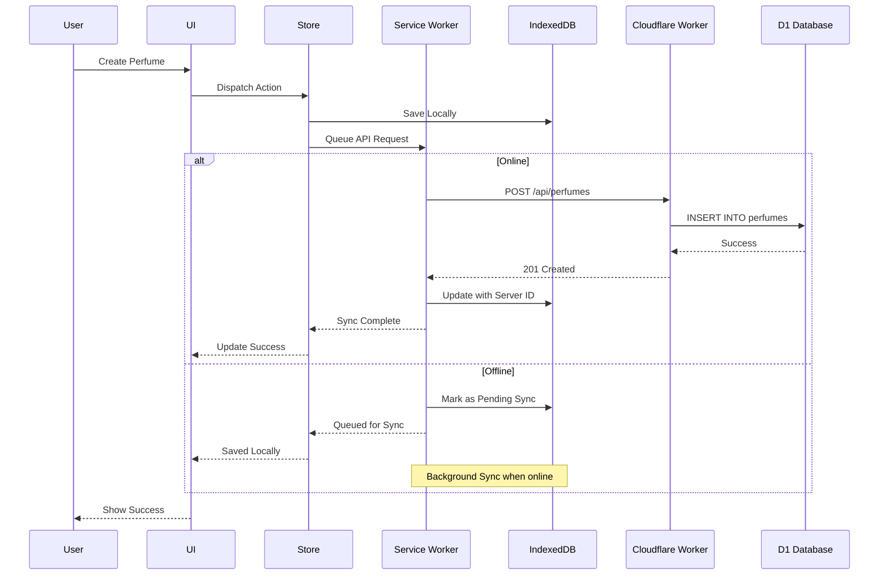
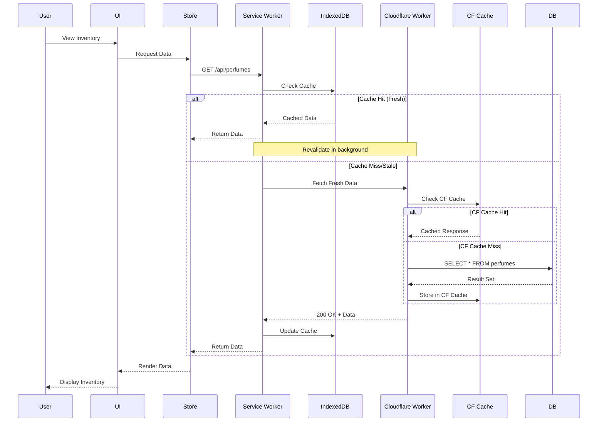
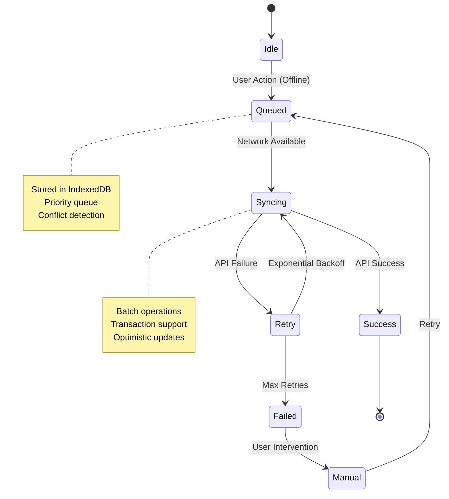
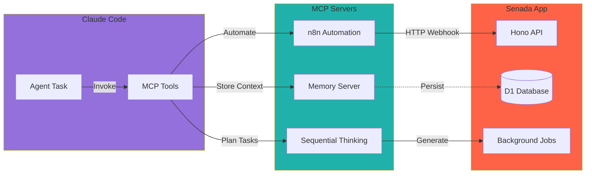
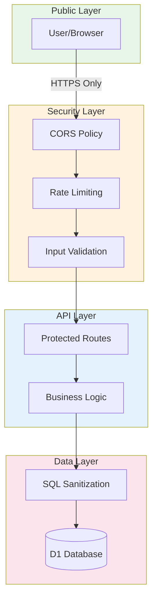
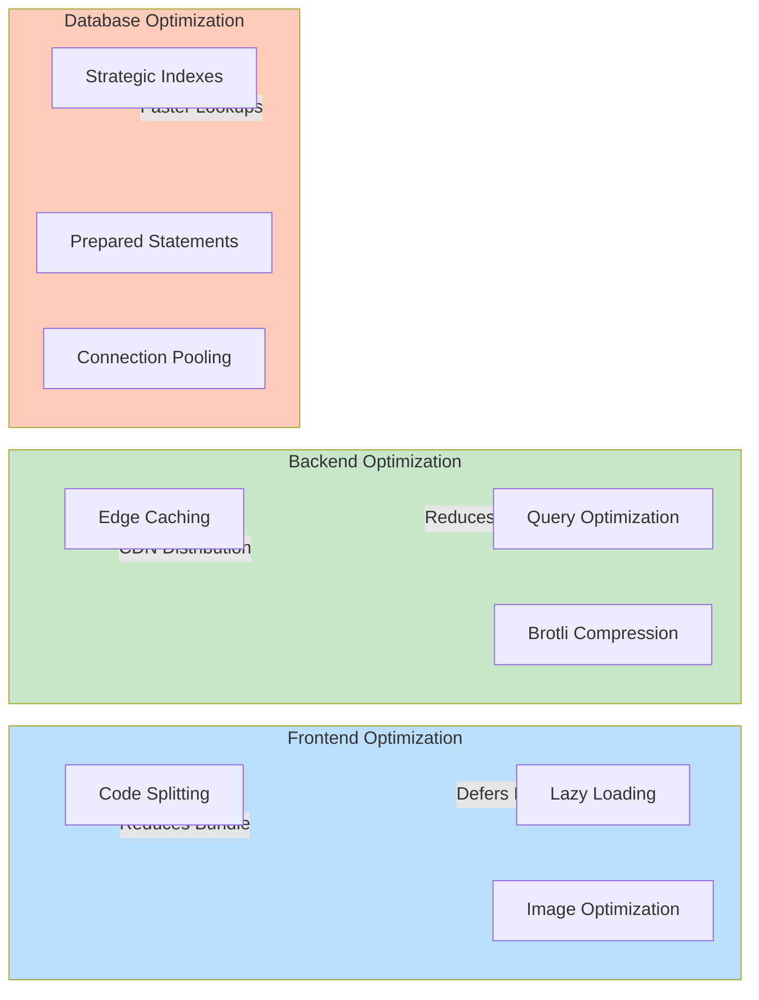
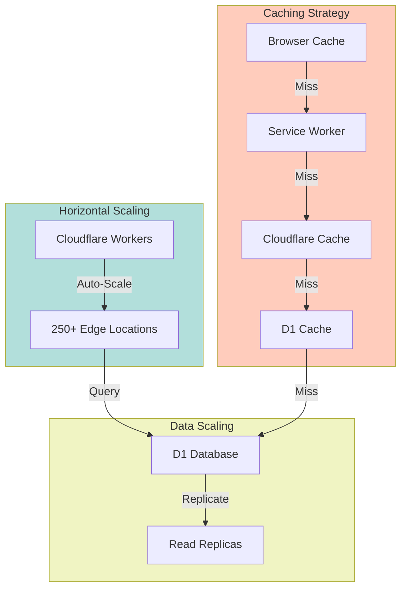
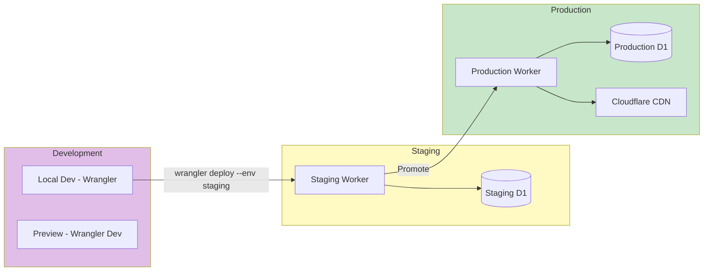

# Senada - System Architecture

## Executive Summary

Senada is a modern, offline-first perfume inventory management Progressive Web App (PWA) built with cutting-edge web technologies. The architecture prioritizes performance, offline capabilities, and developer experience while maintaining enterprise-grade reliability.

**Key Characteristics:**
- **Offline-First**: Full functionality without internet connection
- **Edge Computing**: Global deployment via Cloudflare Workers
- **Type-Safe**: End-to-end TypeScript with Drizzle ORM
- **Modern Stack**: Next.js 16, React 19, Server Components
- **Developer Experience**: MCP integration, hot reload, type inference

---

## Architecture Decision Records (ADRs)

### ADR-001: Edge-First Architecture with Cloudflare Workers

**Status**: Accepted
**Date**: 2025-10-26

**Context**: Need for global performance, low latency, and cost-effective serverless architecture.

**Decision**: Use Cloudflare Workers as the primary backend runtime with D1 SQLite database.

**Rationale**:
- **Performance**: 250+ edge locations globally (<50ms latency)
- **Cost**: Free tier supports 100k requests/day
- **Simplicity**: No server management, automatic scaling
- **DX**: Excellent local development with Wrangler
- **Integration**: Native D1 database binding

**Consequences**:
- ✅ Global low latency
- ✅ Zero infrastructure management
- ✅ Cost-effective scaling
- ⚠️ Cold start considerations (mitigated by Keep-Alive)
- ⚠️ Stateless architecture required

**Alternatives Considered**:
- AWS Lambda + Aurora Serverless (higher cost, complexity)
- Vercel + Neon (vendor lock-in, less edge distribution)
- Traditional VPS (manual scaling, maintenance burden)

---

### ADR-002: Offline-First PWA with Serwist

**Status**: Accepted
**Date**: 2025-10-26

**Context**: Users need full inventory management capabilities without internet connectivity.

**Decision**: Implement Service Worker-based offline-first architecture using Serwist with IndexedDB sync.

**Rationale**:
- **User Experience**: Zero disruption during network failures
- **Performance**: Instant loads from cache
- **Data Integrity**: Background sync when online
- **Platform**: Works on mobile, tablet, desktop
- **Standards**: Web platform APIs (future-proof)

**Consequences**:
- ✅ Works offline completely
- ✅ Faster perceived performance
- ✅ Native app-like experience
- ⚠️ Complex state synchronization
- ⚠️ IndexedDB management overhead

**Implementation Strategy**:
```typescript
// Service Worker Strategy
{
  precache: ['/_next/static/**', '/icons/**'],
  runtimeCache: {
    api: 'NetworkFirst',      // Fresh data preferred
    assets: 'CacheFirst',      // Static assets
    images: 'StaleWhileRevalidate'
  },
  backgroundSync: {
    queue: 'inventory-updates',
    maxRetries: 5
  }
}
```

---

### ADR-003: Next.js 16 with React Server Components

**Status**: Accepted
**Date**: 2025-10-26

**Context**: Need modern React features with optimal performance and SEO.

**Decision**: Use Next.js 16 with App Router and React 19 Server Components.

**Rationale**:
- **Performance**: Zero-JS server components for static content
- **DX**: File-based routing, automatic code splitting
- **SEO**: Server-side rendering for public pages
- **Features**: Streaming, Suspense, Server Actions
- **Ecosystem**: Best-in-class tooling and community

**Consequences**:
- ✅ Smaller client bundles
- ✅ Better Core Web Vitals
- ✅ Improved SEO
- ⚠️ Learning curve for RSC patterns
- ⚠️ Client/Server boundary considerations

---

### ADR-004: Drizzle ORM for Type-Safe Database Access

**Status**: Accepted
**Date**: 2025-10-26

**Context**: Need type-safe database queries with excellent DX and performance.

**Decision**: Use Drizzle ORM with Cloudflare D1 adapter.

**Rationale**:
- **Type Safety**: Full TypeScript inference from schema
- **Performance**: Zero runtime overhead, compiles to SQL
- **DX**: Drizzle Studio for visual database management
- **Migrations**: Git-tracked, type-safe migrations
- **D1 Support**: First-class Cloudflare integration

**Consequences**:
- ✅ Compile-time query validation
- ✅ Automatic TypeScript types
- ✅ Visual database management
- ⚠️ Smaller ecosystem vs Prisma
- ⚠️ Some advanced features still evolving

**Schema Example**:
```typescript
export const perfumes = sqliteTable('perfumes', {
  id: text('id').primaryKey(),
  name: text('name').notNull(),
  brand: text('brand').notNull(),
  quantity: integer('quantity').notNull().default(0),
  price: real('price').notNull(),
  createdAt: integer('created_at').notNull()
});
```

---

## System Architecture Diagram



---

## Component Architecture

### Frontend Architecture (Next.js 16)

```mermaid
graph LR
    subgraph Pages["App Router Pages"]
        Home[/app/page.tsx]
        Inventory[/app/inventory/page.tsx]
        Analytics[/app/analytics/page.tsx]
    end

    subgraph Components["React Components"]
        RSC[Server Components]
        RCC[Client Components]
        Forms[Form Components]
    end

    subgraph State["State Management"]
        Zustand[Zustand Store]
        ReactQuery[TanStack Query]
        LocalState[useState/useReducer]
    end

    subgraph API["API Layer"]
        Fetcher[Fetch Wrapper]
        Hooks[Custom Hooks]
        Cache[SWR/Query Cache]
    end

    Pages --> Components
    Components --> State
    Components --> API
    State --> API

    style Pages fill:#4CAF50
    style Components fill:#2196F3
    style State fill:#FF9800
    style API fill:#9C27B0
```

**Frontend Layers:**

1. **Presentation Layer** (React Components)
   - Server Components: Layout, static content
   - Client Components: Interactive UI, forms
   - Shared Components: Buttons, inputs, modals

2. **State Management Layer** (Zustand + TanStack Query)
   - **Zustand**: Global app state (user preferences, UI state)
   - **TanStack Query**: Server state (API data, caching)
   - **Local State**: Component-specific state

3. **Data Access Layer** (API Client)
   - Type-safe API client with Zod validation
   - Automatic retry and error handling
   - Offline queue management

4. **Service Worker Layer** (Serwist)
   - Request interception
   - Cache strategies
   - Background sync

---

### Backend Architecture (Cloudflare Workers)



**Backend Layers:**

1. **Routing Layer** (Hono)
   - RESTful route definitions
   - Request validation (Zod)
   - Response formatting

2. **Middleware Stack**
   - CORS handling
   - Authentication (optional)
   - Request logging
   - Error catching

3. **Service Layer**
   - Business logic encapsulation
   - Transaction management
   - Cross-cutting concerns

4. **Repository Layer**
   - Data access abstraction
   - Query optimization
   - Type-safe database operations

5. **Database Layer**
   - Drizzle ORM
   - D1 SQLite
   - Migration management

---

## Data Flow Architecture

### Create/Update Flow (Offline-First)



### Read Flow (Cache-First)



---

## PWA Offline-First Strategy

### Cache Strategy Matrix

| Resource Type | Strategy | Max Age | Fallback |
|---------------|----------|---------|----------|
| App Shell | **Precache** | ∞ | None (required) |
| API Data | **NetworkFirst** | 5 min | IndexedDB |
| Images | **CacheFirst** | 7 days | Placeholder |
| Fonts | **CacheFirst** | 365 days | System Font |
| Static Assets | **CacheFirst** | 30 days | None |

### Sync Queue Architecture



### Conflict Resolution Strategy

**Last-Write-Wins (LWW) with Timestamp**
```typescript
interface SyncItem {
  id: string;
  operation: 'CREATE' | 'UPDATE' | 'DELETE';
  data: unknown;
  timestamp: number;
  retries: number;
  status: 'pending' | 'syncing' | 'failed';
}

// Conflict resolution
function resolveConflict(local: SyncItem, server: any) {
  if (local.timestamp > server.updatedAt) {
    return 'USE_LOCAL'; // Local changes are newer
  }
  return 'USE_SERVER'; // Server has latest
}
```

---

## MCP Integration Architecture



**MCP Use Cases:**

1. **Automated Testing** (n8n)
   - Trigger API tests on deployment
   - Generate test data
   - Monitor endpoint health

2. **Development Workflow** (Sequential Thinking)
   - Break down features into tasks
   - Generate implementation plans
   - Track progress

3. **Context Persistence** (Memory)
   - Store API decisions
   - Cache query patterns
   - Remember user preferences

---

## Security Architecture



**Security Measures:**

1. **Transport Security**
   - HTTPS enforced
   - HSTS headers
   - Secure cookies (if auth added)

2. **Input Validation**
   - Zod schema validation
   - SQL injection prevention (Drizzle parameterization)
   - XSS protection (React auto-escaping)

3. **Rate Limiting**
   - 100 requests/minute per IP
   - Cloudflare DDoS protection
   - API key throttling (future)

4. **Data Protection**
   - No sensitive data storage initially
   - GDPR compliance ready
   - Audit logging capability

---

## Performance Architecture

### Optimization Strategies



**Performance Targets:**

| Metric | Target | Strategy |
|--------|--------|----------|
| First Contentful Paint | <1.5s | SSR, Code Splitting |
| Time to Interactive | <3.0s | Lazy Loading, Preload |
| Largest Contentful Paint | <2.5s | Image Optimization |
| Cumulative Layout Shift | <0.1 | Reserved Space |
| API Response Time | <200ms | Edge Caching, Indexes |

---

## Scalability Architecture



**Scaling Characteristics:**

- **Automatic Horizontal Scaling**: Workers scale to demand
- **Global Distribution**: 250+ edge locations
- **Database Scaling**: D1 read replicas (future)
- **Cost-Effective**: Pay-per-request pricing
- **No Cold Starts**: Workers kept warm

---

## Deployment Architecture



---

## Technology Stack Summary

### Frontend Stack
- **Framework**: Next.js 16 (App Router)
- **UI Library**: React 19 (Server Components)
- **Language**: TypeScript 5.3+
- **State**: Zustand + TanStack Query
- **Forms**: React Hook Form + Zod
- **Styling**: Tailwind CSS 4
- **PWA**: Serwist (Service Worker)
- **Storage**: IndexedDB (Dexie.js)

### Backend Stack
- **Runtime**: Cloudflare Workers
- **Framework**: Hono.js
- **Language**: TypeScript 5.3+
- **ORM**: Drizzle
- **Database**: Cloudflare D1 (SQLite)
- **Validation**: Zod

### Development Tools
- **Package Manager**: pnpm
- **Build**: Vite + esbuild
- **Database UI**: Drizzle Studio
- **Deployment**: Wrangler CLI
- **MCP**: n8n, Memory, Sequential Thinking
- **Version Control**: Git

---

## Quality Attributes

### Performance
- ✅ Sub-200ms API responses (edge deployment)
- ✅ <3s Time to Interactive (code splitting, SSR)
- ✅ Offline functionality (Service Worker)
- ✅ Optimistic UI updates

### Reliability
- ✅ 99.99% uptime (Cloudflare SLA)
- ✅ Automatic failover (edge distribution)
- ✅ Data persistence (IndexedDB + D1)
- ✅ Background sync (retry logic)

### Maintainability
- ✅ Type-safe end-to-end (TypeScript)
- ✅ Modular architecture (layers, repositories)
- ✅ Migration system (Drizzle)
- ✅ MCP automation

### Scalability
- ✅ Horizontal auto-scaling (Workers)
- ✅ Global distribution (250+ PoPs)
- ✅ Cost-effective scaling (serverless)
- ✅ Database replication (D1 future)

### Security
- ✅ HTTPS enforced
- ✅ Input validation (Zod)
- ✅ SQL injection prevention (Drizzle)
- ✅ Rate limiting (Cloudflare)

---

## Future Considerations

### Phase 2 Enhancements
1. **Authentication**: Add user authentication (Clerk/Auth.js)
2. **Multi-tenancy**: Support multiple stores
3. **Analytics**: Real-time inventory analytics
4. **Notifications**: Push notifications for low stock
5. **Barcode Scanning**: Camera-based barcode scanner

### Phase 3 Scaling
1. **Read Replicas**: D1 read replicas for global reads
2. **Caching Layer**: Redis for hot data
3. **CDN Assets**: Cloudflare R2 for images
4. **Search**: Full-text search with Cloudflare Vectorize
5. **AI Features**: Smart inventory predictions

---

## Conclusion

The Senada architecture is designed for:
- **Developer Experience**: Type-safe, modern tooling
- **User Experience**: Offline-first, instant interactions
- **Operational Excellence**: Zero maintenance, auto-scaling
- **Cost Efficiency**: Serverless, pay-per-use
- **Future Growth**: Extensible, modular design

This architecture provides a solid foundation for a production-ready perfume inventory management system with room for growth.
