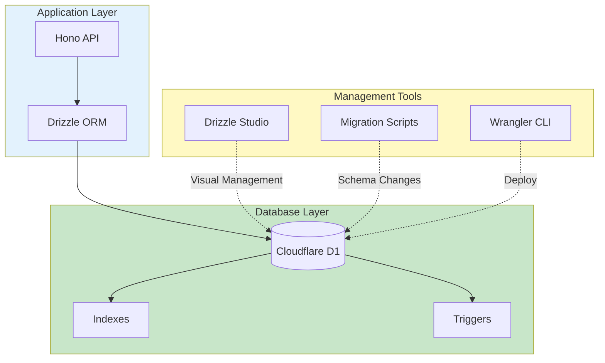
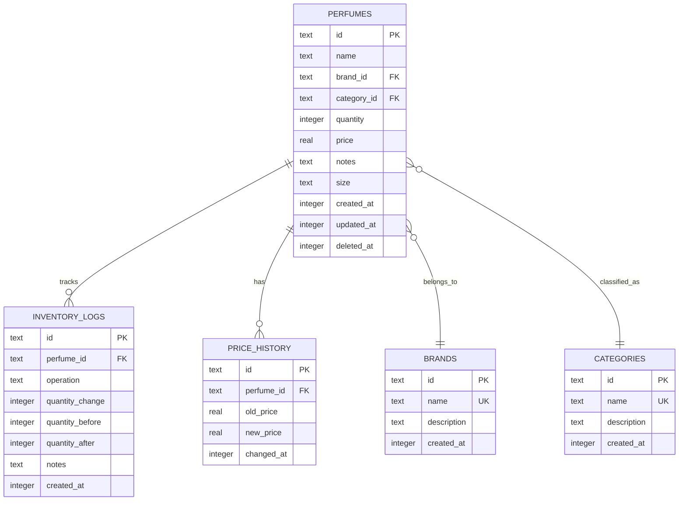

# Senada - Database Design

## Overview

Senada uses **Cloudflare D1**, a serverless SQLite database optimized for edge computing. The database is designed for simplicity, performance, and offline-first synchronization.

**Database Engine**: SQLite 3.x (via Cloudflare D1)
**ORM**: Drizzle ORM
**Migration Tool**: Drizzle Kit
**Management UI**: Drizzle Studio

---

## Database Architecture

### Architecture Diagram



---

## Schema Design

### Entity-Relationship Diagram



---

## Schema Definitions

### 1. Perfumes Table (Primary Entity)

```sql
CREATE TABLE perfumes (
  id TEXT PRIMARY KEY NOT NULL,
  name TEXT NOT NULL,
  brand_id TEXT NOT NULL,
  category_id TEXT,
  quantity INTEGER NOT NULL DEFAULT 0,
  price REAL NOT NULL,
  notes TEXT,
  size TEXT,
  created_at INTEGER NOT NULL,
  updated_at INTEGER NOT NULL,
  deleted_at INTEGER,

  FOREIGN KEY (brand_id) REFERENCES brands(id) ON DELETE RESTRICT,
  FOREIGN KEY (category_id) REFERENCES categories(id) ON DELETE SET NULL,

  CHECK (quantity >= 0),
  CHECK (price > 0)
);

-- Indexes
CREATE INDEX idx_perfumes_brand ON perfumes(brand_id);
CREATE INDEX idx_perfumes_category ON perfumes(category_id);
CREATE INDEX idx_perfumes_created ON perfumes(created_at DESC);
CREATE INDEX idx_perfumes_name ON perfumes(name COLLATE NOCASE);
CREATE INDEX idx_perfumes_deleted ON perfumes(deleted_at) WHERE deleted_at IS NULL;

-- Full-text search (future)
CREATE VIRTUAL TABLE perfumes_fts USING fts5(
  name,
  brand,
  notes,
  content=perfumes
);
```

**Drizzle Schema**:
```typescript
import { sqliteTable, text, integer, real, index } from 'drizzle-orm/sqlite-core';
import { sql } from 'drizzle-orm';

export const perfumes = sqliteTable('perfumes', {
  id: text('id').primaryKey().$defaultFn(() => `perf_${crypto.randomUUID()}`),
  name: text('name').notNull(),
  brandId: text('brand_id').notNull().references(() => brands.id, { onDelete: 'restrict' }),
  categoryId: text('category_id').references(() => categories.id, { onDelete: 'set null' }),
  quantity: integer('quantity').notNull().default(0),
  price: real('price').notNull(),
  notes: text('notes'),
  size: text('size'),
  createdAt: integer('created_at', { mode: 'timestamp' }).notNull().$defaultFn(() => new Date()),
  updatedAt: integer('updated_at', { mode: 'timestamp' }).notNull().$defaultFn(() => new Date()),
  deletedAt: integer('deleted_at', { mode: 'timestamp' }),
}, (table) => ({
  brandIdx: index('idx_perfumes_brand').on(table.brandId),
  categoryIdx: index('idx_perfumes_category').on(table.categoryId),
  createdIdx: index('idx_perfumes_created').on(table.createdAt),
  nameIdx: index('idx_perfumes_name').on(table.name),
}));

export type Perfume = typeof perfumes.$inferSelect;
export type NewPerfume = typeof perfumes.$inferInsert;
```

**Field Descriptions**:

| Column | Type | Nullable | Default | Description |
|--------|------|----------|---------|-------------|
| id | TEXT | No | `perf_{uuid}` | Primary key, auto-generated |
| name | TEXT | No | - | Perfume name (e.g., "Chanel No. 5") |
| brand_id | TEXT | No | - | Foreign key to brands table |
| category_id | TEXT | Yes | NULL | Foreign key to categories table |
| quantity | INTEGER | No | 0 | Current stock quantity |
| price | REAL | No | - | Current price (USD) |
| notes | TEXT | Yes | NULL | Fragrance notes or description |
| size | TEXT | Yes | NULL | Bottle size (e.g., "100ml", "3.4oz") |
| created_at | INTEGER | No | Current timestamp | Unix timestamp (seconds) |
| updated_at | INTEGER | No | Current timestamp | Unix timestamp (seconds) |
| deleted_at | INTEGER | Yes | NULL | Soft delete timestamp |

---

### 2. Brands Table

```sql
CREATE TABLE brands (
  id TEXT PRIMARY KEY NOT NULL,
  name TEXT NOT NULL UNIQUE,
  description TEXT,
  created_at INTEGER NOT NULL
);

CREATE INDEX idx_brands_name ON brands(name COLLATE NOCASE);
```

**Drizzle Schema**:
```typescript
export const brands = sqliteTable('brands', {
  id: text('id').primaryKey().$defaultFn(() => `brand_${crypto.randomUUID()}`),
  name: text('name').notNull().unique(),
  description: text('description'),
  createdAt: integer('created_at', { mode: 'timestamp' }).notNull().$defaultFn(() => new Date()),
}, (table) => ({
  nameIdx: index('idx_brands_name').on(table.name),
}));

export type Brand = typeof brands.$inferSelect;
export type NewBrand = typeof brands.$inferInsert;
```

**Pre-populated Brands**:
```sql
INSERT INTO brands (id, name, created_at) VALUES
  ('brand_chanel', 'Chanel', unixepoch()),
  ('brand_dior', 'Dior', unixepoch()),
  ('brand_gucci', 'Gucci', unixepoch()),
  ('brand_versace', 'Versace', unixepoch()),
  ('brand_ysl', 'Yves Saint Laurent', unixepoch());
```

---

### 3. Categories Table

```sql
CREATE TABLE categories (
  id TEXT PRIMARY KEY NOT NULL,
  name TEXT NOT NULL UNIQUE,
  description TEXT,
  created_at INTEGER NOT NULL
);

CREATE INDEX idx_categories_name ON categories(name COLLATE NOCASE);
```

**Drizzle Schema**:
```typescript
export const categories = sqliteTable('categories', {
  id: text('id').primaryKey().$defaultFn(() => `cat_${crypto.randomUUID()}`),
  name: text('name').notNull().unique(),
  description: text('description'),
  createdAt: integer('created_at', { mode: 'timestamp' }).notNull().$defaultFn(() => new Date()),
}, (table) => ({
  nameIdx: index('idx_categories_name').on(table.name),
}));

export type Category = typeof categories.$inferSelect;
export type NewCategory = typeof categories.$inferInsert;
```

**Pre-populated Categories**:
```sql
INSERT INTO categories (id, name, description, created_at) VALUES
  ('cat_floral', 'Floral', 'Rose, jasmine, lily', unixepoch()),
  ('cat_woody', 'Woody', 'Sandalwood, cedar, oud', unixepoch()),
  ('cat_fresh', 'Fresh', 'Citrus, aquatic, green', unixepoch()),
  ('cat_oriental', 'Oriental', 'Spicy, warm, exotic', unixepoch()),
  ('cat_fruity', 'Fruity', 'Berries, tropical fruits', unixepoch());
```

---

### 4. Inventory Logs Table (Audit Trail)

```sql
CREATE TABLE inventory_logs (
  id TEXT PRIMARY KEY NOT NULL,
  perfume_id TEXT NOT NULL,
  operation TEXT NOT NULL,
  quantity_change INTEGER NOT NULL,
  quantity_before INTEGER NOT NULL,
  quantity_after INTEGER NOT NULL,
  notes TEXT,
  created_at INTEGER NOT NULL,

  FOREIGN KEY (perfume_id) REFERENCES perfumes(id) ON DELETE CASCADE,

  CHECK (operation IN ('ADD', 'REMOVE', 'ADJUST', 'SALE', 'RETURN'))
);

CREATE INDEX idx_logs_perfume ON inventory_logs(perfume_id);
CREATE INDEX idx_logs_created ON inventory_logs(created_at DESC);
CREATE INDEX idx_logs_operation ON inventory_logs(operation);
```

**Drizzle Schema**:
```typescript
export const inventoryLogs = sqliteTable('inventory_logs', {
  id: text('id').primaryKey().$defaultFn(() => `log_${crypto.randomUUID()}`),
  perfumeId: text('perfume_id').notNull().references(() => perfumes.id, { onDelete: 'cascade' }),
  operation: text('operation', { enum: ['ADD', 'REMOVE', 'ADJUST', 'SALE', 'RETURN'] }).notNull(),
  quantityChange: integer('quantity_change').notNull(),
  quantityBefore: integer('quantity_before').notNull(),
  quantityAfter: integer('quantity_after').notNull(),
  notes: text('notes'),
  createdAt: integer('created_at', { mode: 'timestamp' }).notNull().$defaultFn(() => new Date()),
}, (table) => ({
  perfumeIdx: index('idx_logs_perfume').on(table.perfumeId),
  createdIdx: index('idx_logs_created').on(table.createdAt),
  operationIdx: index('idx_logs_operation').on(table.operation),
}));

export type InventoryLog = typeof inventoryLogs.$inferSelect;
export type NewInventoryLog = typeof inventoryLogs.$inferInsert;
```

**Operations**:
- `ADD`: Stock added (restock)
- `REMOVE`: Stock removed (damage, theft)
- `ADJUST`: Manual quantity adjustment
- `SALE`: Item sold
- `RETURN`: Customer return

---

### 5. Price History Table

```sql
CREATE TABLE price_history (
  id TEXT PRIMARY KEY NOT NULL,
  perfume_id TEXT NOT NULL,
  old_price REAL NOT NULL,
  new_price REAL NOT NULL,
  changed_at INTEGER NOT NULL,

  FOREIGN KEY (perfume_id) REFERENCES perfumes(id) ON DELETE CASCADE,

  CHECK (old_price > 0),
  CHECK (new_price > 0)
);

CREATE INDEX idx_price_perfume ON price_history(perfume_id);
CREATE INDEX idx_price_changed ON price_history(changed_at DESC);
```

**Drizzle Schema**:
```typescript
export const priceHistory = sqliteTable('price_history', {
  id: text('id').primaryKey().$defaultFn(() => `price_${crypto.randomUUID()}`),
  perfumeId: text('perfume_id').notNull().references(() => perfumes.id, { onDelete: 'cascade' }),
  oldPrice: real('old_price').notNull(),
  newPrice: real('new_price').notNull(),
  changedAt: integer('changed_at', { mode: 'timestamp' }).notNull().$defaultFn(() => new Date()),
}, (table) => ({
  perfumeIdx: index('idx_price_perfume').on(table.perfumeId),
  changedIdx: index('idx_price_changed').on(table.changedAt),
}));

export type PriceHistory = typeof priceHistory.$inferSelect;
export type NewPriceHistory = typeof priceHistory.$inferInsert;
```

---

## Database Triggers

### Automatic Timestamp Updates

```sql
-- Auto-update updated_at on perfume changes
CREATE TRIGGER perfumes_updated_at
AFTER UPDATE ON perfumes
FOR EACH ROW
BEGIN
  UPDATE perfumes SET updated_at = unixepoch() WHERE id = NEW.id;
END;
```

### Inventory Logging Trigger

```sql
-- Auto-log inventory changes
CREATE TRIGGER perfumes_quantity_log
AFTER UPDATE OF quantity ON perfumes
FOR EACH ROW
WHEN OLD.quantity != NEW.quantity
BEGIN
  INSERT INTO inventory_logs (
    id, perfume_id, operation, quantity_change,
    quantity_before, quantity_after, created_at
  ) VALUES (
    'log_' || lower(hex(randomblob(16))),
    NEW.id,
    CASE
      WHEN NEW.quantity > OLD.quantity THEN 'ADD'
      WHEN NEW.quantity < OLD.quantity THEN 'REMOVE'
      ELSE 'ADJUST'
    END,
    NEW.quantity - OLD.quantity,
    OLD.quantity,
    NEW.quantity,
    unixepoch()
  );
END;
```

### Price Change Logging Trigger

```sql
-- Auto-log price changes
CREATE TRIGGER perfumes_price_log
AFTER UPDATE OF price ON perfumes
FOR EACH ROW
WHEN OLD.price != NEW.price
BEGIN
  INSERT INTO price_history (
    id, perfume_id, old_price, new_price, changed_at
  ) VALUES (
    'price_' || lower(hex(randomblob(16))),
    NEW.id,
    OLD.price,
    NEW.price,
    unixepoch()
  );
END;
```

---

## Indexing Strategy

### Index Types

1. **Primary Indexes** (Automatic)
   - Primary keys: `id` columns
   - Unique constraints: `brands.name`, `categories.name`

2. **Foreign Key Indexes**
   - `perfumes.brand_id` → `brands.id`
   - `perfumes.category_id` → `categories.id`
   - `inventory_logs.perfume_id` → `perfumes.id`

3. **Query Optimization Indexes**
   - `perfumes.created_at DESC` (recent items)
   - `perfumes.name COLLATE NOCASE` (search)
   - `inventory_logs.created_at DESC` (recent logs)

4. **Partial Indexes**
   - `perfumes.deleted_at IS NULL` (soft delete filter)

### Index Performance Analysis

```sql
-- Analyze index usage
EXPLAIN QUERY PLAN
SELECT * FROM perfumes
WHERE brand_id = 'brand_chanel'
ORDER BY created_at DESC
LIMIT 20;

-- Expected: SEARCH using idx_perfumes_brand + idx_perfumes_created
```

**Query Performance Targets**:

| Query Type | Target Time | Index Used |
|------------|-------------|------------|
| List all perfumes | <50ms | idx_perfumes_created |
| Filter by brand | <30ms | idx_perfumes_brand |
| Search by name | <100ms | idx_perfumes_name |
| Get by ID | <10ms | PRIMARY KEY |
| Recent logs | <50ms | idx_logs_created |

---

## Data Integrity Constraints

### Referential Integrity

```sql
-- Prevent brand deletion if perfumes exist
FOREIGN KEY (brand_id) REFERENCES brands(id) ON DELETE RESTRICT

-- Nullify category if deleted
FOREIGN KEY (category_id) REFERENCES categories(id) ON DELETE SET NULL

-- Cascade delete logs when perfume deleted
FOREIGN KEY (perfume_id) REFERENCES perfumes(id) ON DELETE CASCADE
```

### Check Constraints

```sql
-- Ensure positive quantity
CHECK (quantity >= 0)

-- Ensure positive price
CHECK (price > 0)

-- Validate operation types
CHECK (operation IN ('ADD', 'REMOVE', 'ADJUST', 'SALE', 'RETURN'))
```

### Application-Level Validation (Zod)

```typescript
import { z } from 'zod';

export const perfumeSchema = z.object({
  name: z.string().min(1).max(200),
  brandId: z.string().startsWith('brand_'),
  categoryId: z.string().startsWith('cat_').optional(),
  quantity: z.number().int().min(0).max(999999),
  price: z.number().positive().max(999999.99),
  notes: z.string().max(1000).optional(),
  size: z.string().max(50).optional(),
});
```

---

## Migration Workflow

### Migration Files Structure

```
drizzle/
├── schema.ts              # Drizzle schema definitions
├── migrations/
│   ├── 0000_initial.sql
│   ├── 0001_add_brands.sql
│   ├── 0002_add_categories.sql
│   ├── 0003_add_logs.sql
│   └── meta/
│       ├── _journal.json
│       └── 0000_snapshot.json
└── seed.ts                # Seed data script
```

### Creating Migrations

```bash
# Generate migration from schema changes
npx drizzle-kit generate:sqlite

# Apply migrations to local D1
wrangler d1 migrations apply senada-db --local

# Apply migrations to production D1
wrangler d1 migrations apply senada-db --remote
```

### Example Migration: Initial Schema

```sql
-- 0000_initial.sql
CREATE TABLE perfumes (
  id TEXT PRIMARY KEY NOT NULL,
  name TEXT NOT NULL,
  brand_id TEXT NOT NULL,
  quantity INTEGER NOT NULL DEFAULT 0,
  price REAL NOT NULL,
  notes TEXT,
  size TEXT,
  created_at INTEGER NOT NULL,
  updated_at INTEGER NOT NULL,

  CHECK (quantity >= 0),
  CHECK (price > 0)
);

CREATE INDEX idx_perfumes_created ON perfumes(created_at DESC);
CREATE INDEX idx_perfumes_name ON perfumes(name COLLATE NOCASE);
```

### Rollback Strategy

```sql
-- 0000_initial_down.sql (rollback)
DROP INDEX IF EXISTS idx_perfumes_name;
DROP INDEX IF EXISTS idx_perfumes_created;
DROP TABLE IF EXISTS perfumes;
```

**Best Practices**:
- ✅ Always test migrations locally first
- ✅ Create backups before production migrations
- ✅ Use transactions for multi-step migrations
- ✅ Write rollback scripts for critical migrations
- ❌ Never modify existing migrations (create new ones)

---

## Seed Data

### Development Seed Script

```typescript
// drizzle/seed.ts
import { drizzle } from 'drizzle-orm/d1';
import { brands, categories, perfumes } from './schema';

export async function seed(db: D1Database) {
  const orm = drizzle(db);

  // Seed brands
  await orm.insert(brands).values([
    { id: 'brand_chanel', name: 'Chanel' },
    { id: 'brand_dior', name: 'Dior' },
    { id: 'brand_gucci', name: 'Gucci' },
  ]);

  // Seed categories
  await orm.insert(categories).values([
    { id: 'cat_floral', name: 'Floral', description: 'Rose, jasmine, lily' },
    { id: 'cat_woody', name: 'Woody', description: 'Sandalwood, cedar, oud' },
    { id: 'cat_fresh', name: 'Fresh', description: 'Citrus, aquatic, green' },
  ]);

  // Seed perfumes
  await orm.insert(perfumes).values([
    {
      name: 'Chanel No. 5',
      brandId: 'brand_chanel',
      categoryId: 'cat_floral',
      quantity: 15,
      price: 120.00,
      size: '100ml',
      notes: 'Iconic floral aldehyde fragrance'
    },
    {
      name: 'Dior Sauvage',
      brandId: 'brand_dior',
      categoryId: 'cat_fresh',
      quantity: 25,
      price: 95.00,
      size: '100ml',
      notes: 'Fresh and spicy masculine scent'
    },
  ]);

  console.log('✅ Database seeded successfully');
}
```

**Run Seed**:
```bash
# Local
wrangler d1 execute senada-db --local --file=drizzle/seed.sql

# Production (careful!)
wrangler d1 execute senada-db --remote --file=drizzle/seed.sql
```

---

## Query Optimization Patterns

### 1. Pagination with Cursor

```typescript
// Efficient cursor-based pagination
const pageSize = 20;
const lastCreatedAt = '2025-10-26T10:00:00.000Z';

const perfumes = await db
  .select()
  .from(perfumes)
  .where(
    sql`${perfumes.createdAt} < ${lastCreatedAt}`
  )
  .orderBy(desc(perfumes.createdAt))
  .limit(pageSize);
```

### 2. Aggregations with Grouping

```typescript
// Get inventory value by brand
const brandStats = await db
  .select({
    brandId: perfumes.brandId,
    totalItems: count(perfumes.id),
    totalValue: sql<number>`SUM(${perfumes.quantity} * ${perfumes.price})`,
    avgPrice: avg(perfumes.price),
  })
  .from(perfumes)
  .groupBy(perfumes.brandId);
```

### 3. Joins with Relations

```typescript
// Fetch perfumes with brand and category details
const perfumesWithDetails = await db
  .select({
    perfume: perfumes,
    brand: brands,
    category: categories,
  })
  .from(perfumes)
  .leftJoin(brands, eq(perfumes.brandId, brands.id))
  .leftJoin(categories, eq(perfumes.categoryId, categories.id))
  .where(eq(perfumes.deletedAt, null));
```

### 4. Transactions for Consistency

```typescript
// Update quantity and log in transaction
await db.transaction(async (tx) => {
  // Update quantity
  await tx
    .update(perfumes)
    .set({ quantity: sql`${perfumes.quantity} - 1` })
    .where(eq(perfumes.id, perfumeId));

  // Log operation (trigger will also log, but this is explicit)
  await tx.insert(inventoryLogs).values({
    perfumeId,
    operation: 'SALE',
    quantityChange: -1,
    quantityBefore: currentQuantity,
    quantityAfter: currentQuantity - 1,
  });
});
```

---

## Backup and Recovery

### D1 Backup Strategy

**Automatic Backups** (Cloudflare):
- Point-in-time recovery (30-day retention)
- Automatic daily snapshots
- No manual configuration needed

**Manual Backups**:
```bash
# Export database to SQL
wrangler d1 export senada-db --remote --output=backup-$(date +%Y%m%d).sql

# Import from backup
wrangler d1 execute senada-db --remote --file=backup-20251026.sql
```

### Disaster Recovery Plan

1. **Automated Daily Backups**: Cloudflare D1 auto-backup
2. **Weekly Exports**: Manual SQL exports to R2/S3
3. **Restore Procedure**:
   ```bash
   # 1. Create new database
   wrangler d1 create senada-db-recovery

   # 2. Apply latest migration
   wrangler d1 migrations apply senada-db-recovery --remote

   # 3. Import backup
   wrangler d1 execute senada-db-recovery --remote --file=latest-backup.sql

   # 4. Update Worker binding
   # Edit wrangler.toml to point to recovery DB
   ```

---

## Performance Monitoring

### Query Performance Tracking

```typescript
// Middleware to log slow queries
export async function queryLogger<T>(
  queryFn: () => Promise<T>,
  queryName: string
): Promise<T> {
  const start = Date.now();
  try {
    const result = await queryFn();
    const duration = Date.now() - start;

    if (duration > 100) {
      console.warn(`Slow query: ${queryName} took ${duration}ms`);
    }

    return result;
  } catch (error) {
    console.error(`Query failed: ${queryName}`, error);
    throw error;
  }
}

// Usage
const perfumes = await queryLogger(
  () => db.select().from(perfumes).limit(100),
  'listPerfumes'
);
```

### Database Statistics

```sql
-- Table sizes
SELECT
  name,
  SUM(pgsize) as size_bytes
FROM dbstat
GROUP BY name;

-- Index usage
SELECT * FROM sqlite_stat1;

-- Query plan analysis
EXPLAIN QUERY PLAN
SELECT * FROM perfumes WHERE brand_id = 'brand_chanel';
```

---

## Drizzle Studio Usage

### Starting Drizzle Studio

```bash
# Local D1 database
npx drizzle-kit studio --config=drizzle.config.ts

# Opens browser at https://local.drizzle.studio
```

### Features

1. **Visual Schema Editor**: View tables, columns, relationships
2. **Data Browser**: Browse, filter, edit data
3. **Query Runner**: Execute custom SQL queries
4. **Migration Manager**: Generate and apply migrations
5. **Seed Data**: Insert test data visually

---

## Database Scaling

### Current Limits (Cloudflare D1 Free Tier)

| Resource | Limit | Notes |
|----------|-------|-------|
| Database Size | 500 MB | Per database |
| Read Queries/Day | 5 million | Across all databases |
| Write Queries/Day | 100,000 | Across all databases |
| Query Duration | 30 seconds | Max execution time |

### Scaling Strategies

**Phase 1 (Current)**:
- Single D1 database
- Soft deletes (keep deleted_at NULL)
- Efficient indexing

**Phase 2 (Growth)**:
- Read replicas for analytics
- Archival strategy (move old data)
- Caching layer (KV/R2)

**Phase 3 (Enterprise)**:
- Sharding by brand/region
- Dedicated analytics database
- Real-time replication

---

## Security Considerations

### SQL Injection Prevention

```typescript
// ❌ NEVER: String concatenation
const bad = await db.execute(`SELECT * FROM perfumes WHERE name = '${userInput}'`);

// ✅ ALWAYS: Parameterized queries (Drizzle handles this)
const good = await db.select().from(perfumes).where(eq(perfumes.name, userInput));
```

### Access Control

```typescript
// Row-level security (future with multi-tenancy)
export const perfumesRLS = perfumes.$withRLS((userId) =>
  eq(perfumes.userId, userId)
);
```

### Encryption

- **At Rest**: D1 encrypts data automatically (AES-256)
- **In Transit**: HTTPS enforced
- **Sensitive Data**: Avoid storing PII (no user data in v1)

---

## Future Enhancements

### Phase 2 Features

1. **Full-Text Search**:
   ```sql
   CREATE VIRTUAL TABLE perfumes_fts USING fts5(name, brand, notes);
   ```

2. **Soft Delete Cleanup**:
   ```sql
   -- Cron job to permanently delete after 90 days
   DELETE FROM perfumes WHERE deleted_at < unixepoch() - (90 * 86400);
   ```

3. **Multi-Currency Support**:
   ```sql
   ALTER TABLE perfumes ADD COLUMN currency TEXT DEFAULT 'USD';
   ALTER TABLE perfumes ADD COLUMN price_eur REAL;
   ```

4. **User Management** (Multi-Tenancy):
   ```sql
   CREATE TABLE users (
     id TEXT PRIMARY KEY,
     email TEXT UNIQUE NOT NULL,
     created_at INTEGER NOT NULL
   );

   ALTER TABLE perfumes ADD COLUMN user_id TEXT REFERENCES users(id);
   CREATE INDEX idx_perfumes_user ON perfumes(user_id);
   ```

---

## Conclusion

The Senada database is designed for:
- **Simplicity**: SQLite's ease of use
- **Performance**: Strategic indexing, edge deployment
- **Reliability**: Automatic backups, triggers for consistency
- **Scalability**: D1's serverless architecture
- **Developer Experience**: Drizzle ORM, type safety, visual tools

This schema provides a solid foundation for a production-ready inventory management system.
