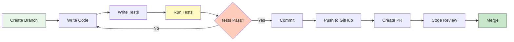

# Senada - Development Guide

## Overview

This guide covers the complete local development workflow for Senada, including setup, tools, testing, and best practices for contributing to the project.

**Tech Stack**:
- **Frontend**: Next.js 16, React 19, TypeScript
- **Backend**: Cloudflare Workers, Hono.js
- **Database**: D1 (SQLite), Drizzle ORM
- **PWA**: Serwist, IndexedDB
- **MCP**: n8n, Memory, Sequential Thinking

---

## Quick Start

### 1. Clone Repository

```bash
# Clone the repository
git clone https://github.com/yourusername/senada.git
cd senada

# Create a new branch for your work
git checkout -b feature/your-feature-name
```

### 2. Install Dependencies

```bash
# Install pnpm (if not already installed)
npm install -g pnpm

# Install project dependencies
pnpm install

# Verify installation
pnpm list
```

### 3. Environment Setup

```bash
# Copy environment template
cp .env.example .env.local

# Edit environment variables
# .env.local
NEXT_PUBLIC_API_URL=http://localhost:8787/api
DATABASE_URL=file:./local.db
NODE_ENV=development
```

### 4. Database Setup

```bash
# Generate Drizzle schema
pnpm run db:generate

# Apply migrations to local D1
pnpm run db:migrate

# (Optional) Seed database with test data
pnpm run db:seed

# Open Drizzle Studio for visual database management
pnpm run db:studio
```

**Database Commands**:
```bash
pnpm run db:generate     # Generate migrations from schema changes
pnpm run db:migrate      # Apply migrations to local D1
pnpm run db:seed         # Seed database with test data
pnpm run db:studio       # Open Drizzle Studio (visual DB manager)
pnpm run db:drop         # Drop all tables (use with caution!)
```

### 5. Start Development Servers

```bash
# Option 1: Start all services concurrently
pnpm run dev

# Option 2: Start services individually
# Terminal 1: Next.js frontend
pnpm run dev:next

# Terminal 2: Cloudflare Workers API
pnpm run dev:worker

# Terminal 3: Drizzle Studio (optional)
pnpm run db:studio
```

**Development URLs**:
- Frontend: http://localhost:3000
- Backend API: http://localhost:8787
- Drizzle Studio: https://local.drizzle.studio

---

## Project Structure

```
senada/
├── app/                          # Next.js App Router
│   ├── (routes)/                 # Route groups
│   │   ├── page.tsx             # Home page
│   │   ├── inventory/           # Inventory management
│   │   │   ├── page.tsx
│   │   │   └── [id]/page.tsx
│   │   └── analytics/           # Analytics dashboard
│   ├── layout.tsx               # Root layout
│   ├── globals.css              # Global styles
│   └── api/                     # API routes (if needed)
│
├── src/                         # Source code
│   ├── components/              # React components
│   │   ├── ui/                  # Base UI components
│   │   ├── forms/               # Form components
│   │   └── inventory/           # Feature components
│   │
│   ├── lib/                     # Utility libraries
│   │   ├── api-client.ts        # API client
│   │   ├── db.ts                # Database connection
│   │   └── utils.ts             # Helper functions
│   │
│   ├── hooks/                   # Custom React hooks
│   │   ├── useInventory.ts
│   │   ├── usePerfumes.ts
│   │   └── useOfflineSync.ts
│   │
│   ├── store/                   # State management (Zustand)
│   │   ├── inventory.ts
│   │   ├── ui.ts
│   │   └── sync.ts
│   │
│   ├── types/                   # TypeScript types
│   │   ├── perfume.ts
│   │   ├── api.ts
│   │   └── db.ts
│   │
│   ├── workers/                 # Cloudflare Workers
│   │   ├── index.ts             # Main worker entry
│   │   ├── routes/              # API routes
│   │   │   ├── perfumes.ts
│   │   │   ├── brands.ts
│   │   │   └── analytics.ts
│   │   ├── middleware/          # Middleware
│   │   │   ├── cors.ts
│   │   │   ├── logger.ts
│   │   │   └── error-handler.ts
│   │   └── services/            # Business logic
│   │       ├── perfume.service.ts
│   │       └── inventory.service.ts
│   │
│   └── sw/                      # Service Worker (Serwist)
│       ├── sw.ts                # Service worker entry
│       └── config.ts            # PWA configuration
│
├── drizzle/                     # Database
│   ├── schema.ts                # Drizzle schema
│   ├── migrations/              # Migration files
│   │   ├── 0000_initial.sql
│   │   └── meta/
│   └── seed.ts                  # Seed data
│
├── tests/                       # Test files
│   ├── unit/                    # Unit tests
│   ├── integration/             # Integration tests
│   └── e2e/                     # End-to-end tests
│
├── public/                      # Static assets
│   ├── icons/                   # PWA icons
│   ├── manifest.json            # Web app manifest
│   └── robots.txt
│
├── docs/                        # Documentation
│   ├── ARCHITECTURE.md
│   ├── API.md
│   ├── DATABASE.md
│   ├── DEPLOYMENT.md
│   └── DEVELOPMENT.md
│
├── .github/                     # GitHub configuration
│   └── workflows/
│       └── deploy.yml           # CI/CD pipeline
│
├── wrangler.toml                # Cloudflare Workers config
├── drizzle.config.ts            # Drizzle ORM config
├── next.config.mjs              # Next.js config
├── tailwind.config.ts           # Tailwind CSS config
├── tsconfig.json                # TypeScript config
├── package.json                 # Dependencies
└── .env.example                 # Environment template
```

---

## Development Workflow

### 1. Feature Development Flow



### 2. Git Workflow

```bash
# 1. Create feature branch
git checkout -b feature/add-barcode-scanner

# 2. Make changes and commit frequently
git add .
git commit -m "feat: add barcode scanning component"

# 3. Keep branch up to date
git fetch origin
git rebase origin/main

# 4. Push to GitHub
git push origin feature/add-barcode-scanner

# 5. Create Pull Request
# Use GitHub UI or gh CLI:
gh pr create --title "Add barcode scanner" --body "Implements barcode scanning for inventory"

# 6. After approval, merge
gh pr merge --squash
```

**Commit Message Convention** (Conventional Commits):
```
feat: Add barcode scanning feature
fix: Resolve offline sync race condition
docs: Update API documentation
style: Format code with Prettier
refactor: Simplify inventory service logic
test: Add unit tests for perfume service
chore: Update dependencies
```

### 3. Code Review Checklist

**Before Creating PR**:
- [ ] Code follows project style guide
- [ ] All tests pass (`pnpm test`)
- [ ] Type checking passes (`pnpm typecheck`)
- [ ] Linting passes (`pnpm lint`)
- [ ] No console.log/debug statements
- [ ] Documentation updated (if needed)
- [ ] PR description explains changes

**Reviewer Checklist**:
- [ ] Code is clear and maintainable
- [ ] Tests cover new functionality
- [ ] No security vulnerabilities
- [ ] Performance considerations addressed
- [ ] Database migrations included (if schema changed)

---

## Development Tools

### 1. Drizzle Studio

**Visual Database Manager** for D1:

```bash
# Start Drizzle Studio
pnpm run db:studio

# Opens browser at https://local.drizzle.studio
```

**Features**:
- Visual schema editor
- Browse and edit data
- Run custom SQL queries
- Generate migrations
- Export/import data

**Common Tasks**:
```sql
-- View all perfumes
SELECT * FROM perfumes LIMIT 10;

-- Count by brand
SELECT brand_id, COUNT(*) as total
FROM perfumes
GROUP BY brand_id;

-- Recent inventory changes
SELECT * FROM inventory_logs
ORDER BY created_at DESC
LIMIT 20;
```

### 2. Wrangler CLI

**Cloudflare Workers development**:

```bash
# Start local dev server
wrangler dev --local --persist

# Test with remote D1 database
wrangler dev --remote --env staging

# View live logs
wrangler tail --env production

# Execute SQL commands
wrangler d1 execute senada-db --local --command="SELECT * FROM perfumes;"

# List deployments
wrangler deployments list
```

### 3. VSCode Extensions

**Recommended Extensions**:
```json
{
  "recommendations": [
    "dbaeumer.vscode-eslint",
    "esbenp.prettier-vscode",
    "bradlc.vscode-tailwindcss",
    "drizzle.drizzle-vscode",
    "ms-vscode.vscode-typescript-next",
    "orta.vscode-jest",
    "mikestead.dotenv"
  ]
}
```

**VSCode Settings** (`.vscode/settings.json`):
```json
{
  "editor.formatOnSave": true,
  "editor.defaultFormatter": "esbenp.prettier-vscode",
  "editor.codeActionsOnSave": {
    "source.fixAll.eslint": true
  },
  "typescript.tsdk": "node_modules/typescript/lib",
  "tailwindCSS.experimental.classRegex": [
    ["cn\\(([^)]*)\\)", "[\"'`]([^\"'`]*).*?[\"'`]"]
  ]
}
```

### 4. TypeScript

**Configuration** (`tsconfig.json`):
```json
{
  "compilerOptions": {
    "target": "ES2022",
    "lib": ["ES2022", "DOM", "DOM.Iterable"],
    "module": "ESNext",
    "moduleResolution": "bundler",
    "jsx": "preserve",
    "strict": true,
    "esModuleInterop": true,
    "skipLibCheck": true,
    "forceConsistentCasingInFileNames": true,
    "resolveJsonModule": true,
    "isolatedModules": true,
    "incremental": true,
    "plugins": [{ "name": "next" }],
    "paths": {
      "@/*": ["./src/*"],
      "@/components/*": ["./src/components/*"],
      "@/lib/*": ["./src/lib/*"],
      "@/hooks/*": ["./src/hooks/*"],
      "@/types/*": ["./src/types/*"]
    }
  },
  "include": ["next-env.d.ts", "**/*.ts", "**/*.tsx", ".next/types/**/*.ts"],
  "exclude": ["node_modules"]
}
```

**Type Checking**:
```bash
# Check all TypeScript files
pnpm run typecheck

# Watch mode
pnpm run typecheck:watch
```

---

## Testing Strategy

### 1. Unit Tests (Vitest)

**Test Structure**:
```typescript
// src/services/perfume.service.test.ts
import { describe, it, expect, beforeEach } from 'vitest';
import { PerfumeService } from './perfume.service';

describe('PerfumeService', () => {
  let service: PerfumeService;

  beforeEach(() => {
    service = new PerfumeService();
  });

  describe('createPerfume', () => {
    it('should create a new perfume', async () => {
      const input = {
        name: 'Test Perfume',
        brandId: 'brand_test',
        quantity: 10,
        price: 50.00,
      };

      const result = await service.createPerfume(input);

      expect(result).toMatchObject({
        id: expect.stringContaining('perf_'),
        name: 'Test Perfume',
        quantity: 10,
        price: 50.00,
      });
    });

    it('should throw error for invalid price', async () => {
      const input = {
        name: 'Test Perfume',
        brandId: 'brand_test',
        quantity: 10,
        price: -10.00, // Invalid
      };

      await expect(service.createPerfume(input)).rejects.toThrow(
        'Price must be positive'
      );
    });
  });
});
```

**Run Tests**:
```bash
# Run all tests
pnpm test

# Watch mode
pnpm test:watch

# Coverage report
pnpm test:coverage

# Run specific test file
pnpm test src/services/perfume.service.test.ts
```

### 2. Integration Tests

**API Integration Tests**:
```typescript
// tests/integration/api.test.ts
import { describe, it, expect } from 'vitest';
import { unstable_dev } from 'wrangler';

describe('Perfumes API', () => {
  it('should list perfumes', async () => {
    const worker = await unstable_dev('src/workers/index.ts', {
      experimental: { disableExperimentalWarning: true },
    });

    const response = await worker.fetch('/api/perfumes');
    const data = await response.json();

    expect(response.status).toBe(200);
    expect(data.success).toBe(true);
    expect(data.data.items).toBeInstanceOf(Array);

    await worker.stop();
  });

  it('should create perfume', async () => {
    const worker = await unstable_dev('src/workers/index.ts');

    const response = await worker.fetch('/api/perfumes', {
      method: 'POST',
      headers: { 'Content-Type': 'application/json' },
      body: JSON.stringify({
        name: 'Test Perfume',
        brandId: 'brand_test',
        quantity: 5,
        price: 75.00,
      }),
    });

    expect(response.status).toBe(201);

    await worker.stop();
  });
});
```

### 3. E2E Tests (Playwright)

**Setup Playwright**:
```bash
pnpm add -D @playwright/test
npx playwright install
```

**E2E Test Example**:
```typescript
// tests/e2e/inventory.spec.ts
import { test, expect } from '@playwright/test';

test.describe('Inventory Management', () => {
  test('should add new perfume to inventory', async ({ page }) => {
    await page.goto('http://localhost:3000/inventory');

    // Click "Add Perfume" button
    await page.click('button:has-text("Add Perfume")');

    // Fill form
    await page.fill('input[name="name"]', 'Chanel No. 5');
    await page.fill('input[name="quantity"]', '10');
    await page.fill('input[name="price"]', '120.00');

    // Submit
    await page.click('button[type="submit"]');

    // Verify success
    await expect(page.locator('text=Perfume added successfully')).toBeVisible();
  });

  test('should work offline', async ({ page, context }) => {
    await page.goto('http://localhost:3000/inventory');

    // Go offline
    await context.setOffline(true);

    // Add perfume offline
    await page.click('button:has-text("Add Perfume")');
    await page.fill('input[name="name"]', 'Offline Perfume');
    await page.fill('input[name="quantity"]', '5');
    await page.fill('input[name="price"]', '50.00');
    await page.click('button[type="submit"]');

    // Verify queued for sync
    await expect(page.locator('text=Queued for sync')).toBeVisible();

    // Go back online
    await context.setOffline(false);

    // Wait for sync
    await expect(page.locator('text=Synced successfully')).toBeVisible();
  });
});
```

**Run E2E Tests**:
```bash
# Run all E2E tests
pnpm test:e2e

# Run in headed mode (see browser)
pnpm test:e2e:headed

# Generate test report
pnpm test:e2e -- --reporter=html
```

### 4. Test Coverage Goals

| Type | Target Coverage | Priority |
|------|----------------|----------|
| Unit Tests | 80%+ | High |
| Integration Tests | 70%+ | Medium |
| E2E Tests | Key flows | High |

**View Coverage**:
```bash
pnpm test:coverage

# Opens HTML report in browser
open coverage/index.html
```

---

## MCP Tools Usage

### 1. n8n Automation

**Use Case**: Automate API testing after deployments

```bash
# Install n8n MCP server
claude mcp add n8n npx @modelcontextprotocol/server-n8n

# Create workflow in n8n to:
# 1. Trigger on webhook (deployment event)
# 2. Run API health checks
# 3. Send notification on failure
```

**Example Workflow**:
```json
{
  "nodes": [
    {
      "name": "Webhook",
      "type": "n8n-nodes-base.webhook",
      "parameters": { "path": "deploy-hook" }
    },
    {
      "name": "HTTP Request",
      "type": "n8n-nodes-base.httpRequest",
      "parameters": {
        "url": "https://senada.workers.dev/api/health",
        "method": "GET"
      }
    },
    {
      "name": "Check Status",
      "type": "n8n-nodes-base.if",
      "parameters": {
        "conditions": {
          "boolean": [
            { "value1": "={{$json.status}}", "value2": "healthy" }
          ]
        }
      }
    }
  ]
}
```

### 2. Memory Server

**Use Case**: Store development context across sessions

```bash
# Install Memory MCP server
claude mcp add memory npx @modelcontextprotocol/server-memory
```

**Store API Decisions**:
```typescript
// Store in memory for future reference
await mcp.memory.store('api-versioning-strategy', {
  decision: 'Use URL versioning (/v1, /v2)',
  rationale: 'Explicit, easy to route',
  date: '2025-10-26',
});

// Retrieve later
const strategy = await mcp.memory.retrieve('api-versioning-strategy');
```

### 3. Sequential Thinking

**Use Case**: Break down complex features into tasks

```bash
# Install Sequential Thinking MCP server
claude mcp add sequential-thinking npx @modelcontextprotocol/server-sequential-thinking
```

**Example: Plan Barcode Scanner Feature**:
```typescript
const plan = await mcp.thinking.plan('Add barcode scanner to inventory app');

// Returns:
// 1. Research barcode libraries (quagga.js, zxing)
// 2. Create BarcodeScannerComponent
// 3. Integrate camera access (getUserMedia)
// 4. Add barcode to perfume search
// 5. Write tests for scanner
// 6. Update documentation
```

---

## Code Style Guide

### 1. TypeScript Best Practices

```typescript
// ✅ GOOD: Type-safe, explicit
interface CreatePerfumeInput {
  name: string;
  brandId: string;
  quantity: number;
  price: number;
}

async function createPerfume(input: CreatePerfumeInput): Promise<Perfume> {
  const validated = createPerfumeSchema.parse(input);
  return await db.insert(perfumes).values(validated);
}

// ❌ BAD: Using 'any', implicit types
async function createPerfume(input: any) {
  return await db.insert(perfumes).values(input);
}
```

### 2. React Component Patterns

**Server Components** (default):
```typescript
// app/inventory/page.tsx
import { getPerfumes } from '@/lib/api';

export default async function InventoryPage() {
  const perfumes = await getPerfumes();

  return (
    <div>
      <h1>Inventory</h1>
      <PerfumeList perfumes={perfumes} />
    </div>
  );
}
```

**Client Components** (interactive):
```typescript
'use client';

import { useState } from 'react';
import { usePerfumes } from '@/hooks/usePerfumes';

export function PerfumeForm() {
  const [name, setName] = useState('');
  const { createPerfume } = usePerfumes();

  const handleSubmit = async (e: React.FormEvent) => {
    e.preventDefault();
    await createPerfume({ name, ... });
  };

  return (
    <form onSubmit={handleSubmit}>
      {/* Form fields */}
    </form>
  );
}
```

### 3. Tailwind CSS Conventions

```typescript
// ✅ GOOD: Use cn() utility for conditional classes
import { cn } from '@/lib/utils';

function Button({ variant, className }: ButtonProps) {
  return (
    <button
      className={cn(
        'px-4 py-2 rounded-md font-medium transition',
        variant === 'primary' && 'bg-blue-500 text-white hover:bg-blue-600',
        variant === 'secondary' && 'bg-gray-200 text-gray-800 hover:bg-gray-300',
        className
      )}
    >
      Click Me
    </button>
  );
}

// ❌ BAD: String concatenation
function Button({ variant, className }: ButtonProps) {
  return (
    <button className={'px-4 py-2 ' + (variant === 'primary' ? 'bg-blue-500' : 'bg-gray-200') + ' ' + className}>
      Click Me
    </button>
  );
}
```

### 4. Error Handling

```typescript
// ✅ GOOD: Type-safe error handling
import { z } from 'zod';

try {
  const validated = schema.parse(input);
  const result = await createPerfume(validated);
  return { success: true, data: result };
} catch (error) {
  if (error instanceof z.ZodError) {
    return { success: false, error: 'Validation failed', details: error.errors };
  }
  if (error instanceof DatabaseError) {
    return { success: false, error: 'Database error' };
  }
  throw error; // Re-throw unexpected errors
}

// ❌ BAD: Silent failure
try {
  await createPerfume(input);
} catch (error) {
  console.log(error);
}
```

---

## Performance Optimization

### 1. React Performance

```typescript
// Use React.memo for expensive components
export const PerfumeList = React.memo(({ perfumes }: PerfumeListProps) => {
  return (
    <ul>
      {perfumes.map(perfume => (
        <PerfumeCard key={perfume.id} perfume={perfume} />
      ))}
    </ul>
  );
});

// Use useMemo for expensive calculations
const sortedPerfumes = useMemo(
  () => perfumes.sort((a, b) => a.name.localeCompare(b.name)),
  [perfumes]
);

// Use useCallback for event handlers
const handleDelete = useCallback(
  (id: string) => deletePerfume(id),
  [deletePerfume]
);
```

### 2. Database Query Optimization

```typescript
// ✅ GOOD: Use indexes, limit results
const perfumes = await db
  .select()
  .from(perfumes)
  .where(eq(perfumes.brandId, brandId))
  .limit(20);

// ❌ BAD: Select all without limit
const perfumes = await db.select().from(perfumes);
```

### 3. Bundle Optimization

```typescript
// next.config.mjs
export default {
  experimental: {
    optimizePackageImports: ['lucide-react', 'date-fns'],
  },
  webpack: (config) => {
    config.optimization.splitChunks = {
      chunks: 'all',
      cacheGroups: {
        vendor: {
          test: /[\\/]node_modules[\\/]/,
          priority: 10,
        },
      },
    };
    return config;
  },
};
```

---

## Debugging

### 1. Browser DevTools

**React DevTools**:
- Install React DevTools extension
- Inspect component tree
- Profile performance

**Network Tab**:
- Monitor API requests
- Check cache headers
- Verify offline functionality

**Application Tab**:
- Inspect IndexedDB
- View Service Worker status
- Check Cache Storage

### 2. VSCode Debugging

**Launch Configuration** (`.vscode/launch.json`):
```json
{
  "version": "0.2.0",
  "configurations": [
    {
      "name": "Next.js: debug server-side",
      "type": "node-terminal",
      "request": "launch",
      "command": "pnpm run dev"
    },
    {
      "name": "Next.js: debug client-side",
      "type": "chrome",
      "request": "launch",
      "url": "http://localhost:3000"
    },
    {
      "name": "Wrangler: debug worker",
      "type": "node-terminal",
      "request": "launch",
      "command": "wrangler dev --local"
    }
  ]
}
```

### 3. Logging Best Practices

```typescript
// Use structured logging
console.log(JSON.stringify({
  timestamp: new Date().toISOString(),
  level: 'info',
  message: 'Perfume created',
  data: { perfumeId: 'perf_123' },
}));

// In production, use logging service (future)
import { log } from '@/lib/logger';

log.info('Perfume created', { perfumeId: 'perf_123' });
log.error('Database error', { error, query });
```

---

## Troubleshooting

### Common Issues

**Issue 1: "Module not found"**
```bash
# Clear Next.js cache
rm -rf .next

# Reinstall dependencies
rm -rf node_modules pnpm-lock.yaml
pnpm install
```

**Issue 2: "Database locked"**
```bash
# Stop Drizzle Studio
pkill -f "drizzle-kit studio"

# Restart worker
wrangler dev --local
```

**Issue 3: "Type errors in node_modules"**
```bash
# Skip lib check temporarily
# tsconfig.json
{
  "compilerOptions": {
    "skipLibCheck": true
  }
}
```

**Issue 4: "Service Worker not updating"**
```bash
# Clear browser cache
# Chrome DevTools > Application > Storage > Clear site data

# Unregister service worker
# Chrome DevTools > Application > Service Workers > Unregister
```

---

## Resources

### Documentation
- [Next.js Docs](https://nextjs.org/docs)
- [Cloudflare Workers Docs](https://developers.cloudflare.com/workers/)
- [Drizzle ORM Docs](https://orm.drizzle.team/)
- [Hono.js Docs](https://hono.dev/)
- [Serwist Docs](https://serwist.pages.dev/)

### Community
- [Cloudflare Discord](https://discord.gg/cloudflaredev)
- [Next.js Discord](https://discord.gg/nextjs)
- [GitHub Discussions](https://github.com/yourusername/senada/discussions)

---

## Conclusion

This development guide provides everything needed to contribute to Senada effectively. Follow these practices to maintain code quality, performance, and developer experience.

Happy coding!
