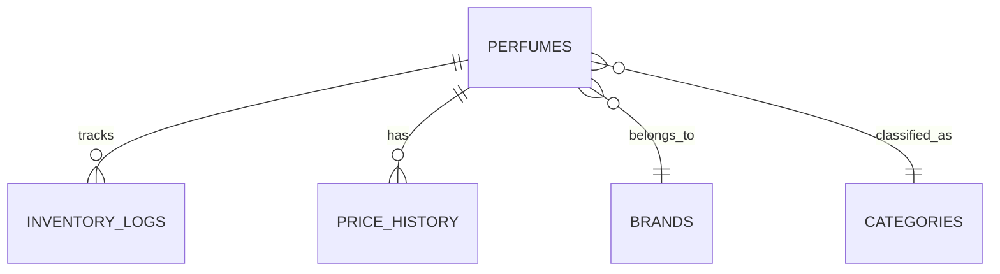
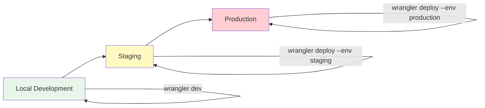

# Senada Documentation

Welcome to the Senada documentation. This directory contains comprehensive documentation for the Senada perfume inventory management application.

## Documentation Index

### Core Documentation

1. **[ARCHITECTURE.md](./ARCHITECTURE.md)** - System Architecture Overview
   - Architecture Decision Records (ADRs)
   - System diagrams and component interactions
   - Frontend and backend architecture
   - Data flow architecture
   - PWA offline-first strategy
   - MCP integration points
   - Performance and scalability considerations

2. **[API.md](./API.md)** - API Documentation
   - Complete endpoint reference
   - Request/response schemas
   - Authentication strategy
   - Error handling patterns
   - Rate limiting
   - TypeScript SDK examples
   - WebSocket support (future)

3. **[DATABASE.md](./DATABASE.md)** - Database Design
   - Schema definitions and diagrams
   - Entity-relationship diagrams
   - Indexing strategy
   - Migration workflow
   - Drizzle ORM patterns
   - Performance optimization
   - Backup and recovery

4. **[DEPLOYMENT.md](./DEPLOYMENT.md)** - Deployment Guide
   - Cloudflare Workers deployment
   - D1 database setup
   - Environment configuration
   - CI/CD with GitHub Actions
   - Custom domains
   - Monitoring and logging
   - Rollback procedures

5. **[DEVELOPMENT.md](./DEVELOPMENT.md)** - Development Workflow
   - Local setup instructions
   - Project structure
   - Development tools (Drizzle Studio, Wrangler)
   - Testing strategy
   - Code style guide
   - MCP tools usage
   - Debugging techniques

6. **[ADR-TEMPLATE.md](./ADR-TEMPLATE.md)** - Architecture Decision Record Template
   - Template for documenting architectural decisions
   - Example ADR included
   - Decision-making framework

---

## Quick Start

### For New Developers

1. Start with **[DEVELOPMENT.md](./DEVELOPMENT.md)** to set up your local environment
2. Review **[ARCHITECTURE.md](./ARCHITECTURE.md)** to understand system design
3. Reference **[API.md](./API.md)** when working with endpoints
4. Consult **[DATABASE.md](./DATABASE.md)** for schema changes

### For DevOps/Deployment

1. Follow **[DEPLOYMENT.md](./DEPLOYMENT.md)** for production deployment
2. Reference **[DATABASE.md](./DATABASE.md)** for migration procedures
3. Use **[ARCHITECTURE.md](./ARCHITECTURE.md)** for infrastructure decisions

### For Product/Business

1. Read **[ARCHITECTURE.md](./ARCHITECTURE.md)** for high-level overview
2. Review **[API.md](./API.md)** to understand capabilities
3. Check **[DEPLOYMENT.md](./DEPLOYMENT.md)** for scaling considerations

---

## Architecture Overview

### Technology Stack

**Frontend**:
- Next.js 16 (App Router)
- React 19 (Server Components)
- TypeScript 5.3+
- Tailwind CSS 4
- Serwist (PWA)

**Backend**:
- Cloudflare Workers
- Hono.js
- Drizzle ORM
- Cloudflare D1 (SQLite)

**Development**:
- Wrangler CLI
- Drizzle Studio
- pnpm
- Vitest, Playwright

**MCP Tools**:
- n8n (Automation)
- Memory Server (Context)
- Sequential Thinking (Planning)

### Key Features

- **Offline-First**: Full functionality without internet
- **Edge Computing**: Global deployment via Cloudflare
- **Type-Safe**: End-to-end TypeScript
- **Modern Stack**: Latest web technologies
- **Developer Experience**: MCP integration, hot reload

---

## Architecture Decisions

The following Architecture Decision Records document key technical decisions:

### Accepted ADRs

- **[ADR-001: Edge-First Architecture with Cloudflare Workers](./ARCHITECTURE.md#adr-001-edge-first-architecture-with-cloudflare-workers)**
  - Decision to use Cloudflare Workers as primary backend runtime
  - Rationale: Global performance, cost-effective, zero infrastructure management

- **[ADR-002: Offline-First PWA with Serwist](./ARCHITECTURE.md#adr-002-offline-first-pwa-with-serwist)**
  - Decision to implement Service Worker-based offline-first architecture
  - Rationale: Zero disruption during network failures, native app-like experience

- **[ADR-003: Next.js 16 with React Server Components](./ARCHITECTURE.md#adr-003-nextjs-16-with-react-server-components)**
  - Decision to use Next.js 16 with App Router and React 19 Server Components
  - Rationale: Optimal performance, SEO, modern React features

- **[ADR-004: Drizzle ORM for Type-Safe Database Access](./ARCHITECTURE.md#adr-004-drizzle-orm-for-type-safe-database-access)**
  - Decision to use Drizzle ORM with Cloudflare D1
  - Rationale: Type safety, zero runtime overhead, excellent DX

---

## API Overview

### Base URL
```
Production: https://senada.your-subdomain.workers.dev
Local: http://localhost:8787
```

### Core Endpoints

| Endpoint | Method | Description |
|----------|--------|-------------|
| `/api/health` | GET | Health check |
| `/api/perfumes` | GET | List perfumes |
| `/api/perfumes` | POST | Create perfume |
| `/api/perfumes/:id` | GET | Get single perfume |
| `/api/perfumes/:id` | PATCH | Update perfume |
| `/api/perfumes/:id` | DELETE | Delete perfume |
| `/api/analytics/summary` | GET | Inventory statistics |

See **[API.md](./API.md)** for complete API reference.

---

## Database Schema

### Core Tables



**Tables**:
- `perfumes` - Main inventory table
- `brands` - Perfume brands (Chanel, Dior, etc.)
- `categories` - Fragrance categories (Floral, Woody, etc.)
- `inventory_logs` - Audit trail of inventory changes
- `price_history` - Price change tracking

See **[DATABASE.md](./DATABASE.md)** for detailed schema.

---

## Deployment Workflow



**Environments**:
- **Local**: Development with hot reload
- **Staging**: Pre-production testing
- **Production**: Live application

See **[DEPLOYMENT.md](./DEPLOYMENT.md)** for deployment procedures.

---

## Development Workflow

### Standard Development Cycle

1. **Setup**: Install dependencies, configure environment
2. **Develop**: Write code, run local server
3. **Test**: Unit, integration, E2E tests
4. **Review**: Code review, type checking, linting
5. **Deploy**: Staging → Production

### Common Commands

```bash
# Install dependencies
pnpm install

# Start development servers
pnpm run dev

# Run tests
pnpm test

# Type check
pnpm typecheck

# Lint
pnpm lint

# Build
pnpm run build

# Deploy to staging
wrangler deploy --env staging

# Deploy to production
wrangler deploy --env production
```

See **[DEVELOPMENT.md](./DEVELOPMENT.md)** for detailed workflow.

---

## MCP Integration

### Available MCP Servers

1. **n8n** - Workflow automation
   - Automate API testing
   - Deploy notifications
   - Data synchronization

2. **Memory** - Context persistence
   - Store development decisions
   - Cache API patterns
   - Remember user preferences

3. **Sequential Thinking** - Task planning
   - Break down features
   - Generate implementation steps
   - Track progress

See **[ARCHITECTURE.md](./ARCHITECTURE.md#mcp-integration-architecture)** for integration details.

---

## Performance Targets

| Metric | Target | Strategy |
|--------|--------|----------|
| First Contentful Paint | <1.5s | SSR, Code Splitting |
| Time to Interactive | <3.0s | Lazy Loading, Preload |
| API Response Time | <200ms | Edge Caching, Indexes |
| Offline Capability | 100% | Service Worker, IndexedDB |

---

## Security

### Security Measures

- **Transport**: HTTPS enforced, HSTS headers
- **Input Validation**: Zod schema validation
- **SQL Injection**: Drizzle ORM parameterization
- **XSS Protection**: React auto-escaping
- **Rate Limiting**: 100 requests/minute per IP
- **CORS**: Configurable origin restrictions

See **[ARCHITECTURE.md](./ARCHITECTURE.md#security-architecture)** for security details.

---

## Scaling Considerations

### Current Limits (Free Tier)

| Resource | Limit |
|----------|-------|
| Workers Requests | 100,000/day |
| D1 Database Size | 500 MB |
| D1 Read Queries | 5 million/day |
| D1 Write Queries | 100,000/day |

### Scaling Strategies

**Phase 2** (Growth):
- Read replicas for analytics
- Archival strategy for old data
- Caching layer (KV/R2)

**Phase 3** (Enterprise):
- Sharding by brand/region
- Dedicated analytics database
- Real-time replication

See **[ARCHITECTURE.md](./ARCHITECTURE.md#scalability-architecture)** for scaling plans.

---

## Contributing

### Before Contributing

1. Read **[DEVELOPMENT.md](./DEVELOPMENT.md)** for setup
2. Review **[ARCHITECTURE.md](./ARCHITECTURE.md)** for design principles
3. Check existing **[ADRs](./ADR-TEMPLATE.md)** for context
4. Follow code style guide in **[DEVELOPMENT.md](./DEVELOPMENT.md#code-style-guide)**

### Creating an ADR

When making architectural decisions, document them using the **[ADR Template](./ADR-TEMPLATE.md)**:

1. Copy `ADR-TEMPLATE.md`
2. Rename to `ADR-XXX-title.md`
3. Fill in all sections
4. Submit as part of PR

---

## Support and Resources

### Documentation
- [Next.js Docs](https://nextjs.org/docs)
- [Cloudflare Workers Docs](https://developers.cloudflare.com/workers/)
- [Drizzle ORM Docs](https://orm.drizzle.team/)
- [Hono.js Docs](https://hono.dev/)

### Community
- [GitHub Issues](https://github.com/yourusername/senada/issues)
- [GitHub Discussions](https://github.com/yourusername/senada/discussions)
- [Cloudflare Discord](https://discord.gg/cloudflaredev)

---

## License

[Your License Here]

---

## Changelog

### v1.0.0 (2025-10-26)
- Initial documentation release
- Complete architecture design
- API documentation
- Database schema
- Deployment guide
- Development workflow

---

**Last Updated**: 2025-10-26
**Maintainer**: [Your Name/Team]
